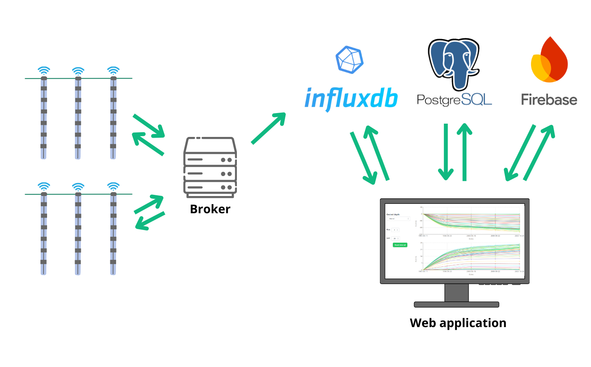

# Development Of A Web Interface For An Inclinometer Monitoring System (Work in progress)
### Repository containing the frontend and backend components of the project

<figure>
  
  <figcaption>Figure 1: System Architecture.</figcaption>
</figure>

--------
## Deployment Information

### Prerequisites

- [Java](https://www.oracle.com/java/technologies/javase/jdk17-archive-downloads.html) (v17+)
- [Node.js](https://nodejs.org/)
- [Docker](https://www.docker.com/)
- [pgAdmin - PostgreSQL](https://www.pgadmin.org/)

### Database setup

#### PostgreSQL

To set up PostgreSQL:

- Create a new database named `localdbpg` on port `5432`.

- Set the database owner to match the credentials in the `application.properties` file, located at `src/main/resources/application.properties`.

- Default credentials:
  `Username: admin`
  `Password: admin`
#### InfluxDB
Download the InfluxDB data from the link below:
https://drive.google.com/drive/folders/1QdjXW3dugP1aomYH2CUfetgoeh2nrTgk?usp=sharing

After downloading, create a docker container and import the data.

#### Firebase
The Firebase configuration is available for download (access required):
https://drive.google.com/drive/folders/1RHliTz2s7AaJuE3C5526-n0mEGiKiCkv?usp=sharing

After downloading, add the Firebase configuration file to the `frontend/src` directory.

### Backend and frontend setup

#### Backend

Use the configuration file `WebInterfaceIpiSystemApplication.run.xml` to run the backend.

> **Note**: The IDE used in this project is [IntelliJ IDEA](https://www.jetbrains.com/idea/), but feel free to use any IDE that suits your workflow.

#### Frontend

Run the following commands to start the server:
```bash
cd frontend
npm install  # Install dependencies if not already installed
npm start
```

> **Note**: After successfully installing all the required components, authentication is required to send any requests to the backend.
While the system is not yet complete, a temporary solution is in place, and the `AccessToken` needs to be manually updated in the corresponding files.
> 
To authenticate, send a `POST` request to `http://localhost:8080/api/auth` with the following JSON payload:

```json
{
  "email": "example@email.com",
  "password": "1234"
}
```

--------
Project developed by:  
João Palma  

Master in Computer Science and Engineering  
NOVA University Lisbon
